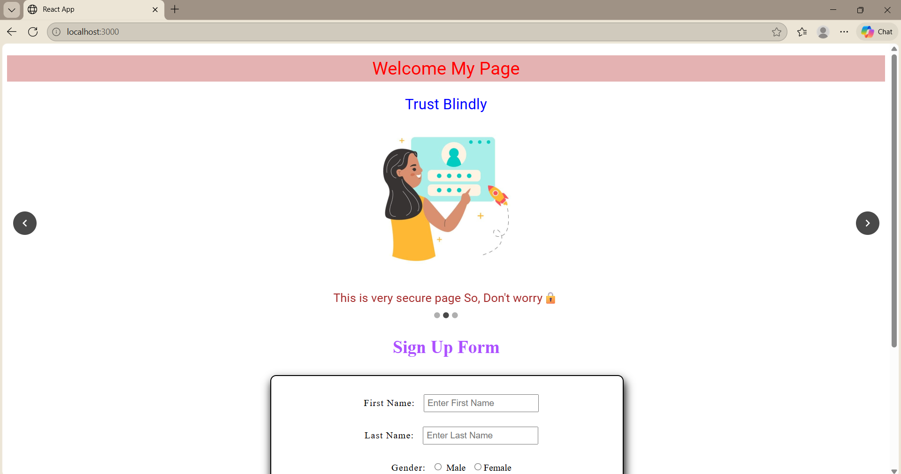

# React JS Internship – Task 1 & 2

This repository contains **Task-1&2** of my React.js internship work.  
The task focuses on creating a **Sign Up Form** with validation and navigating user data to a **Profile page** using React Router and add Slider Carousel.

---

## Work_Demo : Task-1


---

## Work_Demo : Task-2
Slider Using MUI(Material UI) And Carousel



---

## 📌 Task Overview

- Create a Sign Up form using **React Functional Components**
- Validate user input using **Regular Expressions**
- Pass form data to another page using **React Router**
- Display submitted data on a Profile page
- Apply basic styling using **CSS**

---

## 🛠️ Technologies Used

- React.js
- JavaScript (ES6)
- React Router DOM
- CSS
- MUI
- Carousel

---

## 📦 Install Dependencies
Before running the project, install the required dependency:

```bash
npm i react-router-dom
```
```bash
npm i @mui/material @emotion/react @emotion/styled
```
```bash
npm i react-material-ui-carousel
```

---

## 📂 Folder Structure
```
Task-1/
│
├── Form.jsx # Sign Up form with validation
├── Profile.jsx # Displays submitted user data
├── Form.css # Styling for form and profile page
├── Slider.jsx # Slider task 

```

---

## 🧾 Form Features (Form.jsx)

- Input fields:
  - First Name
  - Last Name
  - Gender (Radio Button)
  - City (Dropdown)
  - Email
  - Password
  - Confirm Password
- **Email validation** using RegEx
- **Password validation** using RegEx
- Confirm password match check
- Reset button to clear all fields
- Submit button redirects to Profile page

---

## ▶️ How to Run the Project
```
npm start
```
